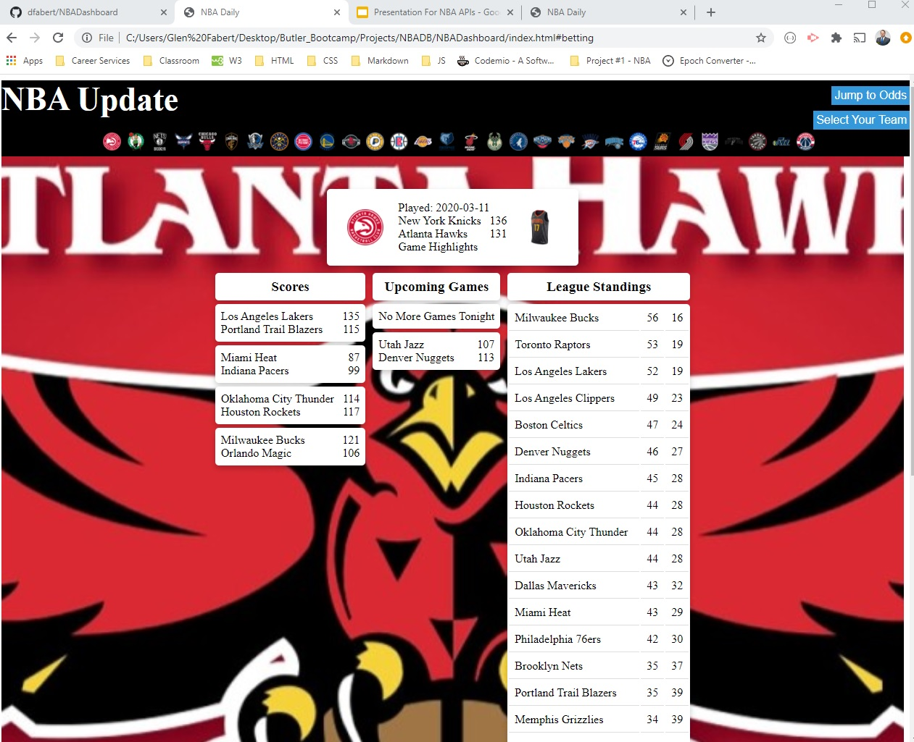

# NBADashboard

The NBA Dashboard is a way for the user to get all of the information on tonight's and last night's NBA Games.  Header allows the user to select thier favorite team or jump to the bottom of the page to show the odds for the upcoming games.  This will also display the most recent game played by the user's favorite team.  

Below that is the scores, upcoming or today's games and the league standings.  

https://github.com/dfabert/NBADashboard

https://dfabert.github.io/NBADashboard/index.html

